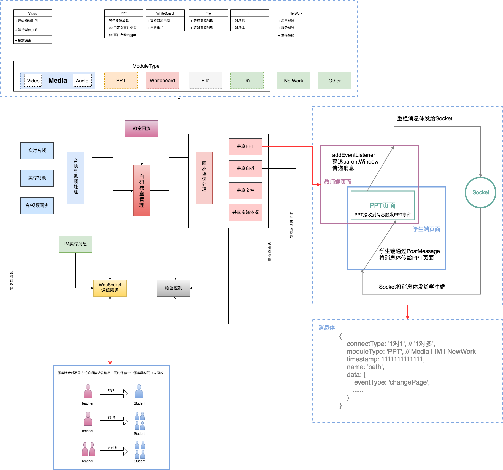
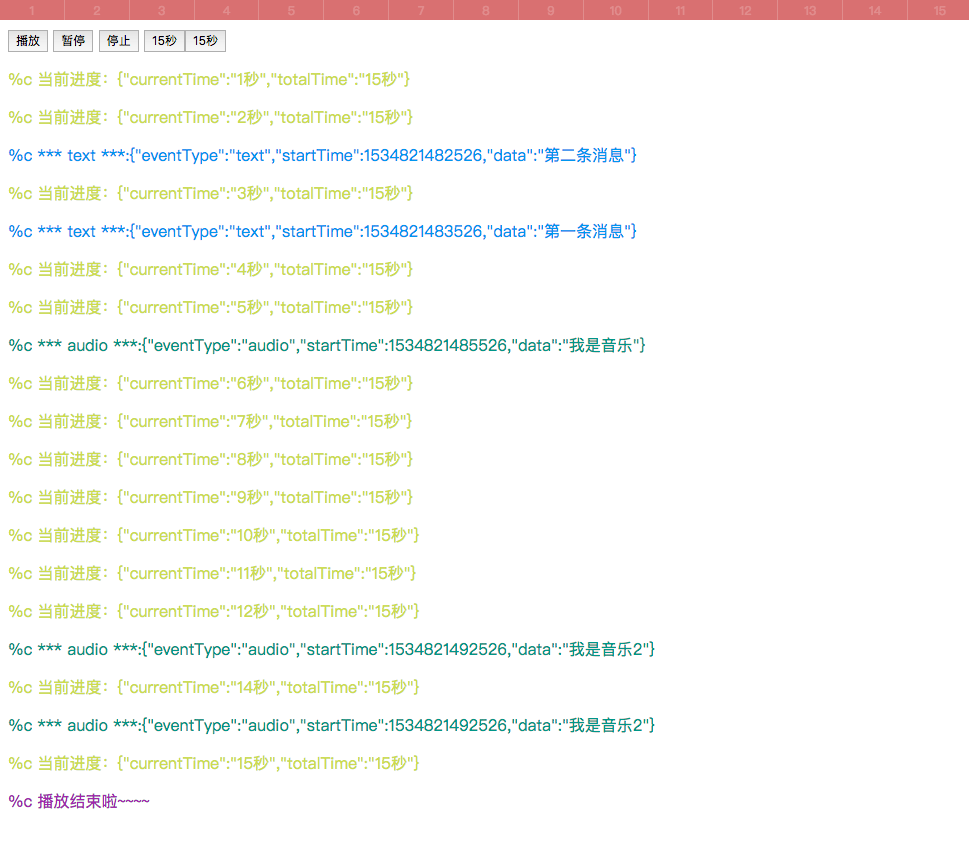

# TimeLine(时间轴插件)
> 应用场景，直播回放的处理

### 设计架构图全览


### 截屏


### 解决的问题
* 1.和时间本身无关，就是要相互同步执行；
* 2.如果有一个模块慢了，其他模块需要进行自动对齐
* 3.如果有一个模块快了，自己需要慢下来（以慢的为基准）
* 4.如何实现链式播放
* 5.如何处理时间差
* 6.加入webWorker方式同一时间事件太多卡死页面
* 7.支持监听progress
* 8.数据为数组对象
* {
*   eventType: 'ppt',
*   startTime: (new Date()).getTime()
*   data: "{ title: '1' }"
* }
* 9.如何实现快放

### Example
[项目地址：https://future-component.github.io/TimeLine/](https://future-component.github.io/TimeLine/)

[演示地址：https://future-component.github.io/TimeLine/example/index.html](https://future-component.github.io/TimeLine/example/index.html)

[GitHub地址：https://github.com/Future-component/TimeLine](https://github.com/Future-component/TimeLine)

### 实例代码
```js
var timeline = TimeLine();
console.log(timeline)
var timeStart = (new Date()).getTime();

function logger(val, style) {
  $('#message').append(`<p style="${style}">${val}</p>`);
}

timeline.init({
  data: [{
    eventType: 'ppt',
    startTime: timeStart + 1000,
    data: 'ppt第一页'
  }, {
    eventType: 'text',
    startTime: timeStart + 3000,
    data: '第一条消息',
  }, {
    eventType: 'text',
    startTime: timeStart + 2000,
    data: '第二条消息',
  }, {
    eventType: 'audio',
    startTime: timeStart + 5000,
    data: '我是音乐'
  }, {
    eventType: 'audio',
    startTime: timeStart + 12000,
    data: '我是音乐2'
  }],
}, {
  text: function(val) { logger('%c *** text ***:' + JSON.stringify(val), 'color: #2196F3') },
  audio: function(val) { logger('%c *** audio ***:' + JSON.stringify(val), 'color: #009688') },
}, function() {
  $('#message').html('');
});

timeline.complete(function() {
  logger('%c 播放结束啦~~~~', 'color: #9C27B0');
  $('.btn').removeClass('active');
})

timeline.progress(function(data) {
  var dataTmp = JSON.parse(data);
  logger('%c 当前进度：' + data, 'color: #CDDC39');
  $('#currentTime').text(dataTmp.currentTime);
  $('#totalTime').text(dataTmp.totalTime);
});

$('.btn').click(function() {
  var id = $(this).attr('id');
  $('.btn').removeClass('active');
  $(this).addClass('active');

  switch(id) {
    case 'play':
      timeline.play();
      break;
    case 'pause':
      timeline.pause();
      break;
    case 'stop':
      timeline.stop();
      break;
    default:
      break;
  }
});
```

### AIP

函数名 | 参数 | 含义 |
:----|:---|:----
init | {options(Object), actions(Object-Func), initPage(Func)} | 初始化时间轴，以及事件在时间轴上的对齐 |
progress | (Func) | 时间轴的当前进度 |
pause | Empty | 暂停时间轴播放 |
stop | Empty | 停止时间轴播放，播放状态回到起点位置 |
play | Empty | 继续播放 |
complete | (Func) | 时间轴完成的回调 |

### TODO
* 资源加载慢的优化问题
* 大数据量的同步问题
* 数据量大时的快放问题


